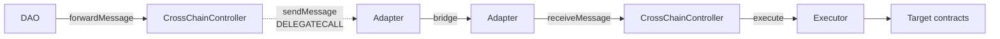

# CrossChain Controller

An [Aragon OSx](https://docs.aragon.org/osx-contracts/1.x/) plugin that lets a DAO execute
actions on another chain.

A DAO proposal on the origin chain calls `forwardMessage` with an encoded `Action[]`. The
`CrossChainController` wraps it in a `Transaction` envelope and hands it to a bridge
adapter. On the destination chain, the adapter authenticates the delivery and passes it to
the `CrossChainController` there, which runs the actions through an `Executor`.

The controller is the single entry point for both directions and holds all configuration.
Adapters hold no routing state, so swapping bridges means deploying a new adapter and
updating the controller's config.

## Flow



The send path is `delegatecall`ed, so the adapter's code runs as the controller: the bridge
fee is paid from the controller's own balance and the bridge attributes the message to the
controller's address. Adapters never custody funds, and the destination trusts the remote
*controller* rather than the adapter.

The receive path is a plain `CALL`, so the adapter runs as itself and reads its own
trusted-remote map.

A lane may also target the chain it lives on, in which case no bridge is involved. See
[Same Chain Delivery](./specs/SPEC.md#same-chain-delivery).

## Contracts

| Contract | Role |
| --- | --- |
| [`CrossChainController`](./src/CrossChainController.sol) | The plugin. Send path, receive path, retry/cancel, lane config, pausing, fee pre-funding and sweeping. |
| [`CrossChainControllerSetup`](./src/CrossChainControllerSetup.sol) | OSx plugin setup. Deploys the proxy and declares the permissions to grant or revoke. |
| [`Executor`](./src/Executor.sol) | `Ownable` variant of the OSx commons executor, so only its owning controller can execute. |
| [`BaseAdapter`](./src/adapters/BaseAdapter.sol) | Shared adapter logic: controller binding, trusted remotes, execution-context checks. |
| [`CCIPAdapter`](./src/adapters/CCIP/CCIPAdapter.sol) | Chainlink CCIP transport. |
| [`IBaseAdapter`](./src/adapters/IBaseAdapter.sol) | The interface every transport must satisfy. |
| [`Transaction`](./src/lib/Transaction.sol) | The message envelope and its state record. |

## Usage

Requires [Foundry](https://book.getfoundry.sh/getting-started/installation).

```shell
forge build
forge fmt
make test            # everything except the fork suite
make test-e2e        # end-to-end suite, in-process, no RPC needed
make test-e2e-fork   # end-to-end against real CCIP routers; needs RPC endpoints
```

Unit suites live in `test/unit/`, one file per function. The end-to-end suites
carry a message the whole way through both stacks — see
[test/e2e/README.md](./test/e2e/README.md).

## Deployment

`CrossChainController` is an OSx plugin, so it needs a `PluginRepo` before any DAO can
install it. `script/CreateRepo.sol` deploys the implementation, the setup contract and the
repo in one go.

Copy `.env.example` to `.env` and fill it in, then simulate and broadcast:

```shell
make predeploy   # simulate
make deploy      # broadcast and verify
make verify      # re-verify from the last broadcast
```

Installing the plugin on a DAO goes through the OSx `PluginSetupProcessor`, pointing at
that repo. Installation parameters are `(executor, guardian, minFailedMessageGas)` — see
`CrossChainControllerSetup.encodeInstallationParameters`. Passing `address(0)` as the
executor makes the setup deploy a dedicated `Executor` owned by the plugin.

## Wiring a lane

Both controllers must exist before either adapter is deployed: an adapter takes its trusted
remote in the constructor and has no setter, and that trusted remote is the *other* chain's
controller.

1. Install `CrossChainController` on both chains.
2. Deploy an adapter on each chain, pointing at the local controller and trusting the
   remote **controller**.
3. Call `updateConfig` on each controller with the remote chain id and
   `{ localAdapter, remoteAdapter }`.

Note the asymmetry: `updateConfig` records the remote **adapter** (the bridge-level
receiver), while the adapter constructor records the remote **controller** (the
authenticated sender). Swapping them makes inbound messages fail with `REMOTE_NOT_TRUSTED`.

Full step-by-step instructions are in [Deployment](./specs/SPEC.md#deployment).

## Funding

There are two separate pots.

**The controller** pays bridge fees from its own balance. Pre-fund it with the fee token
(`address(0)` means native currency) and use `quoteFee` to check the required amount
against what is held. `sweep` moves the funds back out.

**The executor** pays for the actions themselves. Messages carry instructions, never funds,
so any native value or tokens an action spends must already sit on the executor when the
message arrives. An underfunded action is captured as `Delivered` and can be retried once
funded — see [Asset-bearing actions](./specs/SPEC.md#executor) for the ERC20 caveat.

## Documentation

- [specs/SPEC.md](./specs/SPEC.md) — protocol behaviour, permissions, function reference
  and operational runbooks.
- [specs/AUDIT_SPEC.md](./specs/AUDIT_SPEC.md) — audit scope.

## Security

Report vulnerabilities to sirt@aragon.org.

## License

AGPL-3.0-or-later
