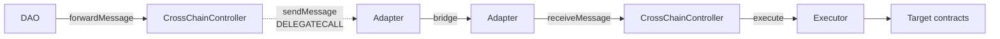

# CrossChain Controller

An [Aragon OSx](https://docs.aragon.org/osx-contracts/1.x/) plugin that lets a DAO execute
actions on another chain.

A DAO proposal on the origin chain calls `forwardMessage` with an encoded `Action[]`. The
`CrossChainController` wraps it in a `Transaction` envelope and hands it to a bridge
adapter. On the destination chain, the adapter authenticates the delivery and passes it to
the `CrossChainController` there, which runs the actions through an `Executor`.

The controller is the single entry point for the send direction and holds the lane
configuration: which local adapter serves a chain, and which remote address to send to.
Inbound messages enter at the local adapter, which authenticates them and is the only
caller `receiveMessage` accepts.

Adapters hold no lane configuration, but they do carry their own trusted-remote map plus an
immutable router, fee token and chain-id table — none of which has a setter. So swapping
bridges, or fixing any adapter-level value, means deploying a new adapter on each side of
the lane and updating both controllers' config.

## Flow



The send path is `delegatecall`ed, so the adapter's code runs as the controller: the bridge
fee is paid from the controller's own balance and the bridge attributes the message to the
controller's address. No protocol path routes funds through an adapter — the controller
pays, and the adapter's balance stays empty — so pre-fund the **controller**, never the
adapter: assets sent directly to an adapter are stranded, as adapters have no rescue path.
The destination trusts the remote *controller* rather than the adapter.

The receive path is a plain `CALL`, so the adapter runs as itself and reads its own
trusted-remote map.

A lane may also target the chain it lives on. The controller's config allows it, but
delivering without a bridge needs a purpose-built loopback adapter — none ships in `src/`,
and `CCIPAdapter` rejects a same-chain destination because CCIP serves no lane to its own
chain. See [Same Chain Delivery](./specs/SPEC.md#same-chain-delivery).

## Contracts

| Contract | Role |
| --- | --- |
| [`CrossChainController`](./src/CrossChainController.sol) | The plugin. Send path, receive path, retry/cancel, lane config, pausing, fee pre-funding and sweeping. |
| [`CrossChainControllerSetup`](./src/CrossChainControllerSetup.sol) | OSx plugin setup. Deploys the proxy and declares the permissions to grant or revoke. |
| [`Executor`](./src/Executor.sol) | `Ownable` variant of the OSx commons executor, so only its owning controller can execute. |
| [`BaseAdapter`](./src/adapters/BaseAdapter.sol) | Shared adapter logic: controller binding, trusted remotes, execution-context checks. |
| [`CCIPAdapter`](./src/adapters/CCIP/CCIPAdapter.sol) | Chainlink CCIP transport. |
| [`IBaseAdapter`](./src/adapters/IBaseAdapter.sol) | The interface every transport must satisfy. |
| [`Transaction`](./src/lib/Transaction.sol) | The message envelope and its lifecycle state. |

## Usage

Requires [Foundry](https://book.getfoundry.sh/getting-started/installation).

```shell
forge build
forge fmt
make test            # the whole suite
make test-e2e        # the end-to-end suites
make test-e2e-fork   # end-to-end against real CCIP routers; requires RPC endpoints
```

The fork tests are not excluded by the first two targets — they skip themselves
unless `MAINNET_RPC_URL` (or `RPC_URL`) and `BASE_RPC_URL` are set, in which case
they will reach the network.

Unit suites live in `test/unit/`, mostly one file per function, plus a few
cross-cutting suites. The end-to-end suites carry a message the whole way through
both stacks — see [test/e2e/README.md](./test/e2e/README.md).

## Deployment

`CrossChainController` is an OSx plugin, so it needs a `PluginRepo` before any DAO can
install it. `script/CreateRepo.sol` deploys the implementation, the setup contract and the
repo in one go.

Copy `.env.example` to `.env` and fill it in, then simulate and broadcast:

```shell
make predeploy   # simulate
make deploy      # broadcast and verify
make verify      # re-verify from the last broadcast
```

Installing the plugin on a DAO goes through the OSx `PluginSetupProcessor`, pointing at
that repo. Installation parameters are `(executor, guardian, minFailedMessageGas)` — see
`CrossChainControllerSetup.encodeInstallationParameters`. Passing `address(0)` as the
executor makes the setup deploy a dedicated `Executor` owned by the plugin.

## Wiring a lane

Both controllers must exist before either adapter is deployed: an adapter takes its trusted
remote in the constructor and has no setter, and that trusted remote is the *other* chain's
controller.

1. Install `CrossChainController` on both chains.
2. Deploy an adapter on each chain, pointing at the local controller and trusting the
   remote **controller**.
3. Call `updateConfig` on each controller with an array of remote chain ids and a
   matching array of `{ localAdapter, remoteAdapter }` configs — it is batch-only,
   and both arrays must be the same length.

Note the asymmetry: `updateConfig` records the remote **adapter** (the bridge-level
receiver), while the adapter constructor records the remote **controller** (the
authenticated sender). Confusing the two is the most common wiring mistake. Pointing the
adapter's trusted remote at the remote *adapter* makes every inbound message fail with
`REMOTE_NOT_TRUSTED`. Getting `updateConfig`'s `remoteAdapter` wrong is worse: nothing fails
early, the send succeeds and the fee is spent. What happens on arrival depends on the
address — a non-contract is skipped by CCIP and the message is silently lost, the remote
controller reverts the delivery, another adapter rejects it — but in every case the
destination controller records nothing.

Full step-by-step instructions are in [Deployment](./specs/SPEC.md#deployment).

## Funding

There are two separate pots.

**The controller** pays bridge fees from its own balance. Pre-fund it with the fee token
(`address(0)` means native currency) and use `quoteFee` to check the required amount
against what is held. `sweep` moves the funds back out.

`quoteFee` returns **three** values — `(address feeToken, uint256 fee, uint256 available)` —
and the third is what the controller currently holds, so the comparison is `fee` against
`available`. Quote it with the full return signature:

```sh
cast call <controller> \
  "quoteFee(uint256,uint256,bytes)(address,uint256,uint256)" \
  <destChainId> <gasLimit> <encodedActions> --rpc-url <rpc>
```

Naming a shorter return list does not error: ABI decoding takes the leading words and drops
the rest, so a single-return signature reads the fee token — `0` for native — which looks
exactly like a quote of zero. An operator sizing a fee budget reads "free" and funds nothing.

**The executor** pays for the actions themselves. Messages carry instructions, never funds,
so whatever an action spends must be available when it runs — normally by pre-funding the
executor. An underfunded action is captured as `Delivered` and can be retried once funded.

Under the shipped wiring the pots are isolated: a dedicated `Executor` holds none of the
controller's permissions, so a payload cannot reach the fee float. They stop being isolated
when the executor holds permissions on the controller — under `executor = dao` an action
runs as the DAO and inherits its `SWEEP`/`FORWARD_MESSAGE` permissions, and an executor
granted `FORWARD_MESSAGE_PERMISSION` can start a chained hop paid from the local float. See
[Asset-bearing actions](./specs/SPEC.md#executor) for that and for the ERC20 caveat.

## Documentation

- [specs/SPEC.md](./specs/SPEC.md) — protocol behaviour, permissions, function reference
  and operational runbooks.
- [specs/AUDIT_SPEC.md](./specs/AUDIT_SPEC.md) — audit scope.

## Security

Report vulnerabilities to sirt@aragon.org.

## License

AGPL-3.0-or-later, except `src/adapters/IBaseAdapter.sol`, which is MIT.
