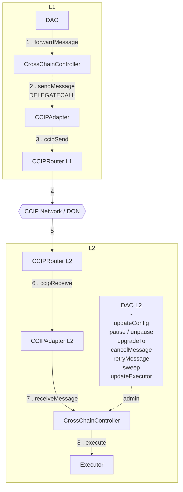
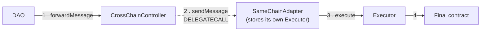

# CrossChain Controller — Specification

The intended behaviour of the `CrossChainController` plugin and its adapters.

## Architecture

The architecture is deliberately flexible: adapters are swappable, because the
`CrossChainController` is the single entry point for both sending and receiving messages,
and it is where all configuration lives. Adapters hold no routing state of their own -
swapping in a new bridge means deploying an adapter and updating the controller's config.

Routing works off a per-destination config, keyed by the standard chain id. The config
stored under that id holds two addresses:

- `localAdapter` - the adapter on this chain that the controller hands the message to.
- `remoteAdapter` - the address on the destination chain that the message is addressed
  to.

On the destination chain, the arriving message is delivered to that remote adapter, which
in turn forwards it to the `CrossChainController` there. The controller is therefore both
ends of every route: the sender's entry point and the receiver's final destination.

Nothing requires the destination to be a *different* chain: a lane may run from chain x to
chain x, since `updateConfig` accepts this chain's own id and the send path never compares
`_destinationChainId` against `block.chainid`. For such a lane, `localAdapter` and
`remoteAdapter` must both be set to the SAME local adapter - it is both the contract the
controller delegatecalls and the address the message is addressed to. See
`test/mocks/SameChainAdapter.sol` for a reference implementation.

## Permissions

Only one adapter is configured per destination chain id at any given time, so that single
bridge is a single point of failure. This demands care when assigning permissions.

**The threat.** Normally L1 governance is what updates the L2 controller's configuration,
and those updates travel over the bridge. If the bridge is compromised - say the L2
`CCIPRouter` - the attacker can inject an arbitrary message and shape it so the L2
`CrossChainController` believes it originated from legitimate L1 governance. The
controller cannot tell the difference: it trusts the bridge to have authenticated the
sender. An attacker with that capability could, for example, rewrite sensitive
configuration on the L2 controller.

**What makes it exploitable.** The controller routes every inbound payload to its
configured `Executor` for final execution. So whatever permissions that executor holds are
effectively reachable by anyone who controls the bridge. If the executor can call the
controller's own sensitive functions, a compromised bridge inherits that power.

This is precisely why the executor is kept separate from the L2 DAO. Pointing the
controller's `executor` at the L2 DAO and granting that DAO sensitive permissions on the
controller reproduces the same exposure - the identity of the executor is irrelevant, only
its permissions matter.

**Recommended configuration.** Set the controller's `executor` to a dedicated
`Executor`, and grant that executor **no permissions on the `CrossChainController`
itself**. Sensitive configuration is then changed only by the L2 DAO acting directly, off
the cross-chain path - so a compromised bridge cannot reach it.

**The alternative.** If you consider bridge compromise a negligible risk, drop the
dedicated `Executor`, set `executor = dao` and grant the sensitive permissions to the DAO.
The L2 can then only be updated over the cross-chain path.

> A `DAO` is required on both chains regardless, because `CrossChainController` is an OSx
> plugin.

> These options are not mutually exclusive: the L2 controller's sensitive functions can be
> made callable by both the `Executor` (over the cross-chain path) and the L2 DAO. That
> keeps L1 governance in control by default while leaving the L2 DAO able to act
> immediately when speed matters - at the cost of accepting the bridge-compromise exposure
> described above.

## Cross-chain flow

> If a dedicated `Executor` is set as the executor on the `CrossChainController`, that
> executor must be given permission on the external contracts it is meant to call. If this
> is no longer required, note that the `Executor`'s ownership cannot be transferred to
> `address(0)` - which would otherwise be the clean way out, as it would mean the
> controller can no longer call the `Executor`, hence the `Executor` can never be called,
> hence those external contracts can never be called by the `Executor` (even if their
> permissions still list it). To achieve the removal, either revoke the `Executor`'s
> permissions on those external contracts, or call `updateExecutor` on the
> `CrossChainController`. Updating the executor means the previously set `Executor` can no
> longer be called, which means the external contracts can no longer be called by that
> executor.

## Same Chain Delivery

A lane can also target the chain it lives on: the whole flow stays local and no bridge is
involved. The controller `delegatecall`s a `SameChainAdapter`, which stores its own
dedicated `Executor` and hands the actions straight to it.

Since `SameChainAdapter` is called with `delegatecall` from `CrossChainController`, the
caller on the `Executor` ends up being the `CrossChainController` (which means the OZ
owner on the `Executor` must be set to the controller). This means that for same chain
delivery, the external contracts on the same chain need to give permission to the
`Executor`, not the DAO. This is safe, because the `Executor`'s owner (the only one that
can call it) is the `CrossChainController`, which can only be called by the DAO - hence in
the end, it is still the DAO that implicitly calls the final external contracts. Note that
if someone else is allowed to call the controller, that someone else will implicitly have
permissions on those external contracts.

> Should you later decide to abandon this approach, it is impossible to change the owner
> on the `Executor` from `CrossChainController` to `address(0)`: the controller has no
> code path that calls the `Executor`'s `transferOwnership` directly, and even if the
> `Executor` were made to call itself with `transferOwnership`, the caller would be the
> `Executor`, not the controller. To achieve the removal, revoke all permissions on the
> external contracts where the `Executor` was granted them, and/or on the
> `CrossChainController` call `updateConfig` for this chain id and either clear the
> adapters or point them at a different `SameChainAdapter` (one that uses a different
> executor).

## Functions

### `CrossChainController`

The message paths that move messages forward (`forwardMessage`, `receiveMessage`,
`retryMessage`) are all `whenNotPaused`. `cancelMessage` and the admin paths
deliberately are not, so an incident can be recovered from while the system is paused
(see the `pause()` row for why cancelling stays available).

| Function | Access | What it does |
|---|---|---|
| `forwardMessage(dstChainId, gasLimit, message)` | `FORWARD_MESSAGE_PERMISSION` | Outbound entry point. Builds a `Transaction` with the next nonce, ABI-encodes it, and `delegatecall`s the local adapter's `sendMessage`. The `delegatecall` is what makes the adapter code run **as the controller**: the bridge fee is paid straight from the controller's own balance so adapters never custody funds, and the bridge attributes the message to the controller's address rather than the adapter's - which is why the far side trusts the remote *controller* as sender, and why an adapter may be swapped without changing who the destination trusts. Returns `txId`. |
| `quoteFee(dstChainId, gasLimit, message)` | view | Quotes the exact bytes `forwardMessage` would send, returning `(feeToken, fee, available)` - the last being this contract's current balance of that token. Use it to check funding before sending. |
| `receiveMessage(messageId, encodedTx, originChainId)` | `onlyLocalAdapter(originChainId)` | Inbound entry point. Decodes the transaction, re-verifies both chain ids against the payload, rejects replays. Success → `Executed`; revert → `Delivered` and retryable. Never reverts on a bad payload. |
| `executeActions(txId, payload)` | self only | Decodes `Action[]` and calls the executor. External purely so `receiveMessage` can wrap it in `try/catch`; decoding lives here so malformed payloads are captured rather than bouncing the bridge delivery. |
| `retryMessage(encodedTx)` | `RETRY_MESSAGE_PERMISSION` | Re-runs a `Delivered` message. Does **not** catch - if it fails again the whole call reverts and the message stays `Delivered`, so it can be retried later. ⚠️ **This permission must never be held by the address configured as the controller's `executor`** (including the DAO when `executor = dao`) - see the warning below the table. The setup grants it to `ANY_ADDR`. |
| `cancelMessage(encodedTx)` | `CANCEL_MESSAGE_PERMISSION` | Burns a `Delivered` message. The `txId` moves to `Cancelled` and never back to `None`, so it can never be re-delivered or retried. |
| `updateConfig(chainIds, configs)` | `MANAGE_CONTROLLER_CONFIG_PERMISSION` | Sets or clears lanes, keyed by **remote** chain id. A lane must be fully set or fully cleared; chain id `0` is rejected as it marks "unset". All-or-nothing because the two halves serve opposite directions and a half-set lane is broken either way: `localAdapter` alone can send but authenticates nothing inbound, `remoteAdapter` alone accepts inbound but cannot send. Requiring both keeps "is this lane configured?" a single unambiguous fact. Clearing both is likewise the only clean way to retire a lane: it shuts the route down in both directions at once, so no outbound message can be sent to a chain that is no longer trusted and no inbound message from it is still accepted. |
| `updateExecutor(executor)` | `MANAGE_CONTROLLER_CONFIG_PERMISSION` | Repoints the controller at a different execution target. Must have code. The call validates **only** that the target has code - it cannot check that the new executor actually authorizes the controller to call `execute`. Repointing to a target that does not is the easiest way to silently brick the receive path; see the executor runbook below. |
| `pause()` / `unpause()` | `PAUSE_PERMISSION` / `UNPAUSE_PERMISSION` | Halts and resumes the three message paths that move messages forward: `forwardMessage`, `receiveMessage` and `retryMessage`. The two directions carry **separate permissions**: a guardian can be trusted to freeze without being trusted to reopen, so a compromised guardian key cannot unpause mid-incident while a malicious message is still pending - the setup grants the guardian `PAUSE_PERMISSION` only, and `UNPAUSE_PERMISSION` stays with the DAO. `cancelMessage` is deliberately **not** gated - pausing exists to stop bad messages from executing, and cancelling is how you stop a pending one for good. If it were gated, the only way to cancel a pending message would be to unpause first, which reopens the paths you just closed. |
| `sweep(token, to, amount)` | `SWEEP_PERMISSION` | Moves pre-funded fee assets out, typically back to the DAO. `address(0)` means native currency. |

> ⚠️ **`RETRY_MESSAGE_PERMISSION` must never be granted to the address configured as the
> controller's `executor`** - including the DAO when `executor = dao`. `retryMessage`
> calls back into the executor, so a retry initiated *from* the executor re-enters
> `execute`:
>
> - `executor = dao`, and a DAO proposal calls `retryMessage`: the flow is
>   `DAO.execute` → `CrossChainController.retryMessage` → `DAO.execute` - reentrancy on
>   the DAO.
> - A dedicated `Executor` holding the permission, triggered over the cross-chain path:
>   `CrossChainController` → `Executor` → `CrossChainController.retryMessage` →
>   `Executor` - reentrancy on the executor.
>
> The executor's reentrancy guard makes every such retry revert, so the retry path is
> unusable for exactly the holder it was granted to. This is why the setup grants
> `RETRY_MESSAGE_PERMISSION` to `ANY_ADDR` (anyone) rather than the DAO: the retried
> payload was already authenticated by the bridge on delivery, and only a `Delivered`
> (failed) message can be retried, so leaving it open is safe. If you narrow it, grant
> it to an address that is **not** the configured executor - e.g. an ops multisig.

### `IBaseAdapter` / `BaseAdapter`

The contract every transport must satisfy. The split in execution context is the key
detail: `sendMessage` is reached only by `delegatecall` from the controller, so it runs
against the controller's storage and balance, while the receive path runs as the adapter
itself so it can read its own trusted-remote map.

| Function | Access | What it does |
|---|---|---|
| `sendMessage(receiver, dstChainId, gasLimit, message)` | `onlyDelegatecallFromController` | Sends over the bridge. Because it is delegatecalled, the fee comes from the **controller's** balance and the bridge attributes the message to the **controller's** address. Returns `(messageId, fee)`. |
| `toNativeChainId(chainId)` / `fromNativeChainId(chainId)` | view | Translates between standard EVM chain ids and the bridge's own encoding. Both **must revert** on unmapped ids - returning `0` would silently address the wrong lane. |
| `_forwardMessage(messageId, payload, originChainId)` | internal | Hands an authenticated inbound message to the controller via a plain `CALL`. Guarded by an `address(this) == _selfAddress` check, so it can never run under `delegatecall`. |

### `Executor`

| Function | Access | What it does |
|---|---|---|
| `execute(callId, actions, allowFailureMap)` | `onlyOwner` | Runs the action batch. The OSx commons `Executor` is permissionless by design; this variant gates it behind `Ownable` so it can be deployed standalone with the controller as owner. All other behaviour - bounds check, failure map, reentrancy guard, `Executed` event - is unchanged. |
| `receive()` | - | Accepts plain ETH transfers so the executor can be pre-funded for value-bearing actions (see below). The commons `Executor` has no payable path, so without this the contract could not be topped up at all. |

> The controller always calls `execute` with an `allowFailureMap` of `0`, so every action
> in an inbound payload must succeed or the whole batch is captured as `Delivered` for
> retry.

**Value-bearing actions.** The messaging layer moves instructions, never funds: only the
encoded `Action[]` bytes cross the bridge, and the entire receive path - the adapter's
bridge callback, `receiveMessage`, `executeActions`, `execute` - is non-payable. An
action may still target a payable function with `value > 0`: `payable` only governs
whether a call can *carry* `msg.value`, not whether a contract can *spend* what it
already holds, so the executor pays `action.value` out of its own balance at execution
time. This is why `receive()` exists - the executor is topped up in advance and the cross-chain action spends from that
balance. Funding is a separate, prior operation; it is never part of the message. If the
balance is short, the action fails, the zero `allowFailureMap` reverts the whole batch,
and the message is captured as `Delivered` - fund the executor and `retryMessage`.

## Deployment

From the Aragon OSx point of view, `CrossChainController` is a **plugin** (see the [plugin docs](https://docs.aragon.org/osx-contracts/1.x/core/plugins/)). Every plugin installation goes through the singleton `PluginSetupProcessor`, which requires the plugin to have its own `PluginRepo` - the registry that holds all of its published versions. A DAO installs a specific version by pointing at that repo.

A `PluginRepo` does not hold the plugin code itself. It holds a `PluginSetup` per version - here `CrossChainControllerSetup` - which acts as the plugin's installer: it deploys the plugin instance and declares the permissions the DAO must grant or revoke. Keeping the setup separate lets every version ship its own installation logic, which matters because these steps are rarely trivial.

Steps to install: Let's assume L1 is mainnet and L2 is base.

Both controllers must exist before either adapter can be deployed: an adapter takes
its trusted remote in the constructor and has no setter, and that trusted remote is
the *other* chain's controller.

1. Install `CrossChainController` on L1. (CCC_L1)
2. Install `CrossChainController` on L2. (CCC_L2)
3. On L1, deploy `CCIPAdapter` (ADAPTER_L1) with:
   - `_crosschainController` = **CCC_L1** - the LOCAL controller. The send path is
     `delegatecall`ed from it, and `onlyDelegatecallFromController` compares
     `address(this)` against this value, so a remote address here makes every send
     revert with `SEND_PATH_NOT_DELEGATECALLED`.
   - `_ccipRouter` = the CCIP Router on L1.
   - `_feeToken` = the fee token, or `address(0)` for native.
   - `_trustedRemoteConfigs` = `[{ standardChainId: <L2 chain id>, trustedRemote: CCC_L2 }]`
     - the remote **controller**, never the remote adapter: the send path is a
     `delegatecall`, so the bridge attributes inbound messages to the controller.
4. On L2, deploy `CCIPAdapter` (ADAPTER_L2) with the mirror image:
   `_crosschainController` = **CCC_L2**, `_ccipRouter` = the CCIP Router on L2,
   `_feeToken` as above, and
   `_trustedRemoteConfigs` = `[{ standardChainId: <L1 chain id>, trustedRemote: CCC_L1 }]`.
5. On L1, call `updateConfig` on CCC_L1 with `_chainIds = [<L2 chain id>]` and
   `_configs = [{ localAdapter: ADAPTER_L1, remoteAdapter: ADAPTER_L2 }]`.
6. On L2, call `updateConfig` on CCC_L2 with `_chainIds = [<L1 chain id>]` and
   `_configs = [{ localAdapter: ADAPTER_L2, remoteAdapter: ADAPTER_L1 }]`.

Note the asymmetry in what each side stores: `updateConfig` records the remote
**adapter** (the bridge-level receiver), while the adapter constructor records the
remote **controller** (the authenticated sender). Swapping them is the most common
wiring mistake - inbound messages are then rejected with `REMOTE_NOT_TRUSTED`.

## Decommissioning a chain (runbook)

Clearing a lane does **not** block that chain's delivered backlog. `updateConfig` and
`cancelMessage` guard two different doors, and retiring a chain requires closing
both:

- `updateConfig` (clear) guards **arrival**: with no `localAdapter` registered,
  `receiveMessage` no longer authenticates the incoming call, so both in-flight and
  future messages from that chain are rejected on delivery.
- `cancelMessage` guards the **backlog**: `retryMessage` never checks whether the
  lane still exists, so any message from that chain already sitting in `Delivered`
  remains retryable after the lane is cleared, until it is cancelled.

To stop trusting a chain, do both in one proposal:

1. `updateConfig([chainId], [all-zero ChainConfig])` - no further messages from that
   chain arrive.
2. `cancelMessage(encodedTx)` for each of that chain's `Delivered` messages -
   nothing it already delivered can ever be retried. The backlog is expected to be
   tiny: messages originate from L1 proposals, so there are few of them, and only
   failed ones sit in `Delivered`.

Doing only step 1 leaves the delivered backlog executable by anyone (the setup grants
`RETRY_MESSAGE_PERMISSION` to `ANY_ADDR`); doing only step 2 leaves the door open for
new deliveries.

## Repointing the executor (runbook)

When calling `updateExecutor`, make sure the new executor **already allows the
controller to call `execute` on it** at the moment of the switch. `updateExecutor`
itself only checks that the target has code; it cannot verify authorization, because
every `IExecutor` implementation gates `execute` its own way:

- `executor = dao` - `DAO.execute` requires the caller to hold `EXECUTE_PERMISSION`
  on the DAO. The setup grants this to the controller only at install time, and only
  when it was *installed* with `executor = dao`. Switching to the DAO later does
  **not** grant it.
- dedicated `Executor` - `execute` is `onlyOwner`. The setup wires ownership only for
  the executor it deploys itself. A new `Executor` deployed later is owned by its
  deployer until someone calls `transferOwnership(controller)`.

**Why this bricks the receive path.** The misconfiguring proposal itself succeeds -
the target has code, `ExecutorUpdated` is emitted, nothing looks wrong. But from that
moment every inbound message reaches `IExecutor(executor).execute(...)` and reverts
(`Unauthorized` / not-owner). The revert is swallowed by `receiveMessage`'s
`try/catch`, so each message quietly lands as `Delivered` instead of executing. 
Recovery needs a second governance round-trip (grant the
permission / transfer ownership) plus a `retryMessage` per stuck message; if the
controller sits on a chain whose only governance path is the cross-chain lane that
was just broken, that round-trip may not even be possible over the lane itself.

An `updateExecutor` proposal must therefore bundle, in this order:

1. The authorization on the new executor - grant the controller
   `EXECUTE_PERMISSION` on the DAO when repointing to the DAO, or
   `transferOwnership(controller)` when repointing to a dedicated `Executor`.
2. The `updateExecutor` call itself.
3. Optionally, revoke the controller's authorization on the *old* executor
   (revoke `EXECUTE_PERMISSION` / transfer the old `Executor`'s ownership away), so
   the abandoned target does not keep a live execution path.

## Uninstallation

Uninstalling the plugin revokes permissions - nothing more. `prepareUninstallation`
returns the revoke list, but a setup contract cannot call into the plugin, so the
controller's own state survives uninstallation untouched: `chainToAdapter` keeps its
lanes, and `receiveMessage` is not gated by a DAO permission - it is guarded only by
that lane config. The result is that an "uninstalled" controller **keeps accepting
inbound messages** from its configured remote chains and keeps executing them on its
executor.

Whether that is dangerous depends on the executor. When `executor = dao`, the
uninstall revokes the controller's `EXECUTE_PERMISSION` on the DAO, so inbound
messages can no longer do anything. But with a dedicated `Executor`, any permissions
the DAO granted that executor on *other* contracts remain reachable: remote
governance - or a compromised bridge - retains exactly that power after the plugin is
"gone".

An uninstall proposal must therefore not consist of the uninstallation alone. Bundle,
in this order:

1. `updateConfig` clearing **every** configured lane (all-zero `ChainConfig` per
   chain id) - shuts the route down in both directions; inbound messages fail
   authentication on arrival. Per the decommissioning runbook above, pair each
   cleared lane with a `cancelMessage` per `Delivered` message: `retryMessage` is
   open to anyone (`RETRY_MESSAGE_PERMISSION` is granted to `ANY_ADDR`), so the
   delivered backlog stays executable until it is cancelled.
2. Optionally `pause()` - belt-and-braces freeze of the message paths; there is no
   reason to leave an abandoned controller unpaused.
3. `sweep` of any pre-funded fee assets back to the DAO.
4. Revoke any permissions the DAO granted the dedicated `Executor` elsewhere.
5. The uninstallation itself.

Steps 1-3 require the permissions being revoked in step 5, so they cannot be done
afterwards - a controller uninstalled first can never be cleaned up.